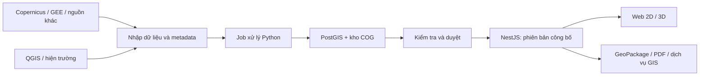

# Nền tảng GIS và viễn thám

Cập nhật: 2026-10-05. Định hướng đã chọn, chưa triển khai backend hoặc thay engine của bản SIC.

## Công nghệ

| Phần | Chọn | Lý do |
|---|---|---|
| Web | React, TypeScript, Vite | Giữ thành phần, contract và quy tắc nghiệp vụ đang có |
| Bản đồ 2D | OpenLayers | CRS tùy chỉnh, raster/vector, WMS/WMTS, chọn và chỉnh hình học |
| Bản đồ 3D | CesiumJS | Địa hình theo tọa độ địa lý, imagery và 3D Tiles. 2D vẫn dùng độc lập |
| API | NestJS, một ứng dụng chia module | Quản lý sự kiện, dữ liệu, quyền, job và công bố. Tái sử dụng TypeScript thuần, không phụ thuộc React |
| Dữ liệu không gian | PostgreSQL/PostGIS | Hình học, truy vấn vùng, phiên bản, trạng thái duyệt và lịch sử |
| Ảnh và DEM | Kho object tương thích S3, COG | Giữ file gốc, sản phẩm và checksum. Đọc raster theo vùng/tỷ lệ |
| Xử lý ảnh | Worker Python với GDAL/PROJ, Rasterio | Chiếu lại, mask chất lượng, phân tích raster và sản xuất dữ liệu |
| Trao đổi với QGIS | GeoPackage trước, GeoServer khi cần dịch vụ dùng chung | GeoPackage phục vụ offline. GeoServer cung cấp WMS/WMTS/WFS khi xuất bản cho nhiều công cụ |

Đây là lựa chọn cho nhu cầu công cụ GIS/viễn thám, không dựa vào việc dự án khác đang dùng C#. Java/Spring vẫn phù hợp với API doanh nghiệp nhưng không đem lại lợi thế cụ thể hơn NestJS trong codebase TypeScript này. Python phụ trách xử lý ảnh, API nghiệp vụ dùng NestJS.

Demo SIC giữ **Leaflet + Three.js**, dữ liệu prepared và Vercel. Chuyển engine sau demo, qua adapter bản đồ chung. Điều kiện chuyển: cùng hình học/CRS, ký hiệu, chọn đối tượng, đo, mặt cắt, nguồn và fallback 2D đều đạt kiểm tra. Không chạy hai engine 2D chồng nhau.

## Không gian làm việc

| Không gian | Người dùng | Luồng chính |
|---|---|---|
| Ứng phó | Cán bộ địa phương, người trực | Sự kiện → địa bàn cần xử lý → kiểm tra tiếp cận → căn cứ → lưu đánh giá |
| Phân tích | Viễn thám, GIS | AOI → tìm ảnh → kiểm chất lượng → so trước/sau hoặc phân tích → kiểm chứng → công bố |
| Quản lý dữ liệu | Người nhập và duyệt | Nhập lớp/nguồn → kiểm tra CRS/hình học → xem trước thay đổi → duyệt phiên bản |

Các không gian dùng chung dataset, danh mục lớp, quy tắc ký hiệu và bản công bố. Tham số xử lý ảnh không xuất hiện thường trực trên màn ứng phó.

Job đầu tiên có trạng thái, tiến độ, phương pháp/version, checksum đầu vào, kết quả và lỗi trong PostgreSQL. Worker nhận job có khóa/lease, thử lại có giới hạn và không công bố kết quả dở. Bổ sung hàng đợi riêng khi khối lượng xử lý cần đến.

## Tích hợp nguồn

| Nguồn | Cách dùng | Điều kiện |
|---|---|---|
| Copernicus Data Space | STAC tìm cảnh, API truy cập/xử lý ảnh. Browser là tham chiếu UX | Catalog hiện hành `https://stac.dataspace.copernicus.eu/v1/`. Kiểm quyền, quota, ngày và mức xử lý |
| Google Earth Engine | Tính toán theo AOI, job xuất kết quả rồi nạp về kho sản phẩm | Không đặt job ảnh dài trong request hoặc đường xử lý ứng phó tức thời |
| EOS | Tạm hiểu là EOSDA LandViewer: tham chiếu tìm ảnh, tổ hợp màu, chỉ số và so ảnh | Tích hợp dữ liệu/API sau khi kiểm chứng dịch vụ, hợp đồng và quyền sử dụng |
| QGIS | Kiểm CRS, geometry, topology, nguồn và style. Nhập/xuất GeoPackage | Không tự đồng bộ mọi lớp sửa trong QGIS thành dữ liệu đã công bố |

Adapter nguồn chạy phía server, giữ khóa API ngoài trình duyệt. Lỗi nhà cung cấp không làm mất bản dữ liệu đã công bố. Chỉ cache/phân phối ảnh khi giấy phép cho phép.

## Hệ tọa độ và chất lượng dữ liệu

WGS84/VN2000 là hệ quy chiếu, không phải kiểu bản đồ nền. Gói SIC dùng WGS84 / UTM 48N (`EPSG:32648`) cho hình học theo mét, WGS84 (`EPSG:4326`) để trao đổi vị trí và Web Mercator (`EPSG:3857`) để hiển thị 2D.

| Nội dung | Quy tắc |
|---|---|
| CRS gốc | Lưu EPSG hoặc WKT2 đầy đủ, thứ tự trục, đơn vị và vùng sử dụng. Không đoán CRS từ tọa độ |
| VN2000 | Cần đúng múi chiếu, kinh tuyến trục, hệ số tỷ lệ và phép chuyển datum. Kiểm bằng điểm khống chế trước khi trộn với WGS84. Chưa hỗ trợ nhập VN2000 trong demo |
| Phép đo | CRS phân tích phù hợp hoặc phương pháp ellipsoid có khai báo. EPSG:3857 chỉ để hiển thị, không dùng trực tiếp làm số đo hiện trường |
| Độ cao | Ghi DSM/DTM, datum đứng, đơn vị, độ phân giải và nodata. Không coi số cao DEM là cao độ khảo sát đường |
| GeoJSON | Kinh độ, vĩ độ WGS84 theo RFC 7946. File nguồn giữ CRS gốc riêng |
| Metadata ảnh | Cảm biến, thời gian thu nhận, processing level, độ phân giải gốc, vùng quan sát hợp lệ, quyền dùng và lineage |
| SAR | Chọn quy trình theo sản phẩm: orbit/calibration, đồng đăng ký, hiệu chỉnh địa hình, kiểm layover/shadow và độ tin cậy. Không gọi chênh màu nền là phát hiện sạt lở |
| Ảnh quang học | Kiểm mây/bóng mây, mức xử lý, mùa và vùng chung. So ảnh với phép resampling phù hợp loại dữ liệu |
| Kết quả | Lưu phương pháp, phiên bản đầu vào, mask chất lượng, thời điểm và người kiểm chứng. Công bố một bộ nhất quán |

Ngày snapshot không thay ngày thu nhận ảnh. Làm mượt ảnh hiển thị không làm tăng độ phân giải nguồn. Quy tắc chuyển datum đối chiếu [PROJ](https://proj.org/en/stable/usage/transformation.html) và [Quyết định 05/2007/QĐ-BTNMT](https://chinhphu.vn/default.aspx?docid=21337&pageid=27160).

## Ứng phó và hướng dẫn tới nơi an toàn

Proposal tập trung ưu tiên cứu hộ và tuyến tiếp cận cho cơ quan địa phương. Hướng dẫn sơ tán là phần mở rộng, cần dữ liệu và quy tắc riêng:

| Cần bổ sung | Điều kiện trước khi sử dụng |
|---|---|
| Nơi trú/điểm an toàn | Vị trí đã kiểm tra, phạm vi phục vụ, sức chứa, khả năng tiếp nhận và giờ xác nhận |
| Tuyến sơ tán | Điểm đầu/đích rõ, phương thức đi bộ/phương tiện, chiều đường, chướng ngại và thời hạn hiệu lực |
| Điều phối | Người có quyền duyệt, căn cứ, phiên bản, nhóm nhận và kênh gửi. Phân biệt đề xuất với lệnh đã duyệt |

Không đảo ngược tuyến cứu hộ để mặc định thành tuyến sơ tán. H đề xuất là bãi đáp chưa khảo sát, không thay nơi trú an toàn.

Thứ tự và điều kiện triển khai theo [lộ trình platform](../plans/platform.md). Catalog prepared có thể chạy trên Vercel trước khi xây backend. Adapter gọi dịch vụ có khóa và job xử lý vẫn nằm phía server khi triển khai.

## Căn cứ lựa chọn

| Tài liệu chính thức | Phần tham khảo |
|---|---|
| [OpenLayers raster reprojection](https://openlayers.org/doc/tutorials/raster-reprojection.html), [QGIS projections](https://docs.qgis.org/latest/en/docs/user_manual/working_with_projections/working_with_projections.html) | CRS tùy chỉnh và quản lý phép chiếu |
| [CesiumJS](https://cesium.com/learn/cesiumjs-learn/), [3D Tiles](https://cesium.com/learn/cesiumjs-learn/cesiumjs-3d-tiles-styling/) | Bản đồ 3D địa lý và dữ liệu phân cấp |
| [GDAL COG](https://gdal.org/en/stable/drivers/raster/cog.html), [OGC STAC](https://www.ogc.org/standards/stac/) | Raster và metadata sản phẩm |
| [CDSE STAC](https://documentation.dataspace.copernicus.eu/APIs/STAC.html), [GEE export](https://developers.google.com/earth-engine/guides/exporting) | Catalog và job ảnh |
| [EOSDA LandViewer](https://eos.com/user-guide/landviewer/), [GeoServer services](https://docs.geoserver.org/stable/en/user/services/index.html) | Tham chiếu UX và trao đổi GIS |
