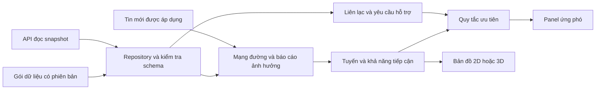

# Kiến trúc hệ thống

Cập nhật: 2026-10-07. Bản mặc định dùng sự kiện Chế Tạo mô phỏng; manifest được chọn qua cấu hình.

## Thành phần đang chạy

| Thành phần | Công nghệ và trách nhiệm | Giới hạn |
|---|---|---|
| Web | Vite, React 18, TypeScript strict, CSS token | Khởi động, điều hướng/công cụ và composition tách trong `app/` |
| Bản đồ 2D | Leaflet, SVG và ảnh được chiếu lại trên CPU | Không cần WebGL hoặc GLB. Nền EOX ngoài khu vực cần mạng |
| Bản đồ 3D | Three.js, DEM và GLB tải khi mở 3D | GPU hoặc GLB lỗi thì chuyển về 2D, giữ lựa chọn |
| Dữ liệu | JSON Schema, Ajv, manifest và SHA-256 | Gói Chế Tạo v0.2 là dữ liệu mô phỏng, chưa được duyệt vận hành |
| Đánh giá | Dijkstra trên mạng đường, quy tắc ưu tiên, ước tính di chuyển | Quy tắc thử nghiệm, chưa phải Community Isolation Score |
| Bản xuất | Canvas 2D tạo PNG, in/lưu PDF, JSON và GeoJSON | Dùng cùng snapshot và ảnh cục bộ. GeoJSON WGS84. Dữ liệu chưa được duyệt |
| So ảnh | GeoTIFF.js đọc ảnh, proj4 chiếu sang Web Mercator, Leaflet so ảnh | GeoTIFF hiển thị 8 bit, tối đa 40 MB/8 triệu pixel mỗi ảnh. Không xử lý SAR hoặc phân loại tác động |
| Lịch sử phiên | Tách tin đã áp dụng khỏi thời điểm đang xem | Hai bản dữ liệu trong phiên. Chưa lưu lịch sử nhiều người dùng |
| API snapshot | Python standard library, HTTP chỉ đọc | Phục vụ thử tích hợp. Chưa tiếp nhận tin, lưu lịch sử hoặc xử lý ảnh |

Cách chạy tại [README](../../README.md). Quy tắc tính tại [phân tích ứng phó](response-analysis.md), định dạng tại [hợp đồng dữ liệu](data-contract.md).

## Dòng dữ liệu

Gói tĩnh và API dùng cùng hợp đồng. API lỗi không được thay bằng dữ liệu mô phỏng. Tin mới tạo lại các kết quả liên quan từ một snapshot, tránh cập nhật đường nhưng giữ nguyên căn cứ hoặc ưu tiên cũ.

## Ranh giới mã

| Vị trí trong `viewer/src` | Trách nhiệm |
|---|---|
| `App.tsx`, `app/` | Khởi động, composition, reducer điều hướng/công cụ và preferences. Packet chưa hợp lệ chỉ hiện tải/lỗi |
| `data/` | Kiểm tra gói, repository prepared/API, adapter cho công cụ địa hình |
| `features/incident/` | Nạp bộ dữ liệu, kiểm tra manifest/packet/CRS, tính snapshot độc lập React, ưu tiên, thông báo và bản dữ liệu đang xem |
| `features/routes/` | Tính tuyến, ước tính di chuyển, mặt cắt |
| `features/map/` | Contract hiển thị/chọn/điều khiển chung, bản đồ Leaflet, ảnh 2D, fallback 3D, nguồn và giới hạn từng lớp |
| `features/search/` | Chỉ mục tên/mã, chuẩn hóa tiếng Việt và hộp tìm trên bản đồ |
| `features/measurement/` | Đo khoảng cách/diện tích UTM, hình đo tạm và thao tác operator trên Leaflet |
| `features/briefing/` | Snapshot đánh giá, xem trước, PNG, bản in PDF và xuất JSON/GeoJSON |
| `features/comparison/` | Kiểm tra ngày/nguồn/CRS, đọc và chiếu ảnh, so ảnh bằng thanh trượt |
| `terrain/` | Tọa độ, lấy mẫu DEM, lớp Three.js, ký hiệu và bố trí nhãn |
| `components/dear/` | Panel, hộp thoại và điều khiển nhận dữ liệu qua props |
| `shared/` | Thành phần và hành vi dùng ở nhiều màn |

Renderer không quyết định ưu tiên. Component không giữ một bản báo cáo riêng. `cheTaoScenario.ts` giữ tương thích kiểm thử cũ, không khởi tạo dữ liệu workspace. `modelRuntime.ts` chỉ tải Three.js và bộ upload khi cần. Điều chỉnh lớp, đo và so ảnh không thay dữ liệu tính tuyến/ưu tiên.

`workspace-config.json` chọn nguồn prepared/API và URL manifest. Loader chỉ trả về khi packet và địa hình khớp manifest. App nhận một bộ hoàn chỉnh hoặc lỗi, không ghép hai phiên bản hoặc thay bộ lỗi bằng bộ mặc định. Build, server thử và gói offline đọc cùng cấu hình. React, Leaflet và bộ kiểm tra schema có chunk riêng; 3D và so ảnh tải khi mở.

[Rà cấu trúc mã](source-structure.md) ghi các phụ thuộc còn cần tách và cấu trúc frontend đích. [Lộ trình platform](../../../vsp-eo-platform/docs/plans/roadmap.md) phân biệt phần demo đã có với catalog, xử lý ảnh và backend chưa triển khai.

## Pipeline theo proposal

| Giai đoạn proposal | Hiện tại | Phần cần tích hợp |
|---|---|---|
| 1. Chuẩn bị trước sự kiện | Ảnh nền, DEM và mạng đường mẫu | SAR tham chiếu, bản đồ nhạy cảm sạt lở, dữ liệu nền được duyệt |
| 2. Kích hoạt sự kiện | Mốc trigger và thông báo mô phỏng | Mưa GPM, ngưỡng kích hoạt, yêu cầu ảnh khẩn cấp qua DMC |
| 3. Phân tích sau sự kiện | Báo cáo ảnh hưởng, tính tuyến và ưu tiên bằng quy tắc. Có công cụ so GeoTIFF | So SAR trước/sau, AI nhận diện tác động, Community Isolation Score và kiểm chứng mạng đường |
| 4. Sản phẩm hỗ trợ quyết định | Bản đồ ưu tiên, tuyến, căn cứ, H đề xuất. Xuất PNG/PDF/JSON/GeoJSON, chạy online/offline | Điểm và vùng tác động được duyệt, điểm số rủi ro/ưu tiên theo phương pháp thống nhất, GeoPackage |

Ưu tiên hiện tại là demo SIC, deploy Vite trên Vercel bằng dữ liệu prepared và không cần backend. Phần mở rộng được thiết kế và triển khai tại repo platform; không biến API snapshot demo thành backend sản phẩm. Kiến trúc và phương án deploy ở [kế hoạch backend](../../../vsp-eo-platform/docs/plans/backend.md). LLM không nằm trong đường tính ưu tiên hiện tại.

[Tiếp nhận và công bố dữ liệu](../../../vsp-eo-platform/docs/architecture/response-publication.md) mô tả nghiệp vụ và contract dự kiến cho luồng ghi. Các luồng này không thuộc bản demo hiện tại.

[Nền tảng GIS và viễn thám](../../../vsp-eo-platform/docs/architecture/geospatial-platform.md) đề xuất baseline công nghệ và quy tắc CRS/nguồn ảnh của platform, cần kiểm chứng trước triển khai. Demo chưa chuyển engine.
