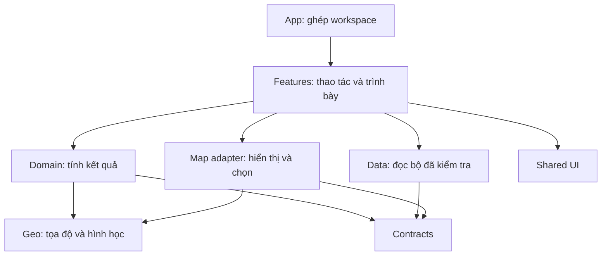

# Cấu trúc mã và trách nhiệm

Phạm vi: `DEM_to_3D/viewer`. Công nghệ ở [kiến trúc GIS](../../../vsp-eo-platform/docs/architecture/geospatial-platform.md), thứ tự triển khai ở [lộ trình platform](../../../vsp-eo-platform/docs/plans/roadmap.md).

## Ranh giới hiện tại

| Phần | Trách nhiệm |
|---|---|
| `app/` | Khởi động, cấu hình, preferences, điều hướng/công cụ và ghép panel/map/dialog. Không đặt thuật toán mới tại shell |
| `features/incident`, `features/routes` | Snapshot và quy tắc ưu tiên/tiếp cận. Hàm tính độc lập React |
| `features/map` | Contract chung cho renderer, lớp, chọn đối tượng và điều khiển map |
| `features/measurement`, `comparison`, `briefing`, `geodata` | State và thao tác của từng công cụ; CSS nằm cạnh feature |
| `features/catalog` | Repository metadata prepared, tìm theo AOI, kiểm cặp và bộ chọn. Phép tính/validation độc lập React; không sở hữu lớp ứng phó hoặc job raster |
| `geo/vector` | Kiểu hình học, validation và độ phủ; không phụ thuộc DOM/React/Leaflet |
| `terrain/`, `components/TerrainViewer.tsx` | Địa hình và renderer cũ, đang chuyển dần sang ranh giới geo/adapter |
| `data/`, `types/` | Manifest, schema, loader và contract hiện tại; kiểm payload/checksum trước khi hiển thị |
| `shared/`, `styles/` | UI/hook không hiểu nghiệp vụ; token và điều khiển dùng chung |

`components/dear/` còn chứa panel của nhiều feature. Khi sửa lớn, chuyển về feature sở hữu thay vì tạo thêm wrapper. Không chia file theo một giới hạn dòng tùy ý.

## Hướng refactor frontend demo

Đây là cấu trúc chuyển dần, chưa phải các thư mục đã triển khai hết.

```text
src/
  app/                 # shell, cấu hình, điều hướng, composition
  contracts/           # DTO, schema, phiên bản và adapter v1/v2
  domain/response/     # tuyến, khả năng tiếp cận, ưu tiên, căn cứ
  geo/                 # CRS, geometry, DEM, profile; không phụ thuộc React
  data/                # repository, catalog, asset loading và cache
  features/            # incident, map, measurement, comparison, briefing...
  map/adapters/        # API renderer và triển khai 2D/3D
  shared/ui/           # button, icon, dialog, field, status, typography
  shared/hooks/        # focus, floating panel, responsive behavior
  styles/              # token, reset, shell; CSS feature ở cạnh feature
```

Luồng phụ thuộc đích:



| Quy tắc | Kiểm tra khi sửa code |
|---|---|
| Domain và geo không import React, DOM hoặc engine map | Unit test chạy không cần trình duyệt. Hằng số kỹ thuật có đơn vị và phạm vi áp dụng |
| Contracts không import feature hoặc renderer | Schema kiểm payload ở ranh giới. Phiên bản cũ đi qua adapter rõ ràng |
| Renderer không tính ưu tiên hoặc cập nhật report | Map nhận kết quả và trả sự kiện chọn. Map 2D/3D dùng cùng revision |
| State nghiệp vụ và state hiển thị tách nhau | Đổi lớp, zoom, panel hoặc công cụ không thay kết quả phân tích |
| Một nơi sở hữu chế độ tương tác | Browse, inspect, measure, edit có chuyển trạng thái rõ. Không để nhiều boolean cùng nhận pointer |
| Kết quả dẫn về dữ liệu và phương pháp | Có input revision, method version, nguồn, thời gian và giới hạn. Không tính lại từ câu mô tả UI |
| Giao diện shared không mang ngữ nghĩa incident | Feature chọn mức cảnh báo và hành động. Shared chỉ hiển thị trạng thái được truyền vào |

Các quy tắc này là đích refactor. Source hiện tại vẫn có phụ thuộc cũ trong `data/cheTaoScenario.ts`, kiểu dữ liệu và renderer, cần chuyển theo từng đợt có kiểm thử.

## Quy tắc bảo trì

| Thay đổi | Nơi sửa |
|---|---|
| Màu/font/kích thước dùng chung | `styles/tokens.css` |
| Bố cục thành phần | CSS feature; không thêm override vào cuối stylesheet chung |
| Công cụ/panel | Feature và composition `app/`; dùng lại focus/floating panel, nhận pointer qua reducer tương tác |
| Thuật toán/dữ liệu | Hàm domain/geo và repository/contracts; không tính từ câu chữ trong JSX |

Phần còn cần tách: phân tích địa hình khỏi shell, toán địa lý khỏi renderer và vòng đời scene/camera. Kiểm phụ thuộc chưa được lint toàn bộ; mỗi đợt cần giữ kiểm tra tương tác, fallback và tài nguyên.

Giữ đường dẫn web hiện tại cho CI/Vercel. Backend và monorepo sản phẩm thuộc [platform](../../../vsp-eo-platform/docs/architecture/source-structure.md), không xây tại repo demo. Kế thừa code theo [handoff](../../../vsp-eo-platform/docs/plans/handoff.md); không import source qua hai repo.

Không duy trì danh sách từng file, số dòng hoặc nhật ký refactor ở đây. Git giữ lịch sử; tài liệu chỉ đổi khi trách nhiệm hoặc hướng phụ thuộc đổi.
