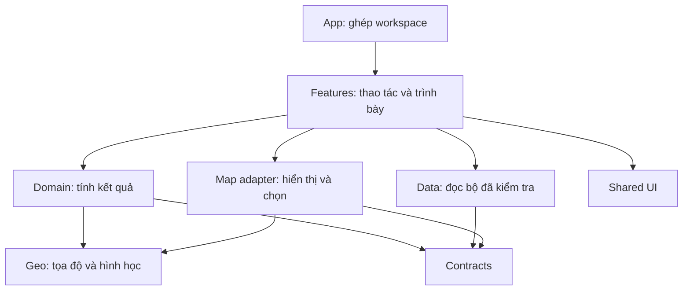

# Cấu trúc mã và ranh giới trách nhiệm

Cập nhật: 2026-10-07. Phạm vi: `DEM_to_3D/viewer`. Đích công nghệ ở [kiến trúc GIS](geospatial-platform.md), thứ tự triển khai ở [kế hoạch platform](../plans/platform.md).

## Kết quả rà soát

Code đã có `features/`, TypeScript strict, kiểm tra schema/checksum, quy tắc tính tuyến và kiểm thử trình duyệt. Có thể tiếp tục phát triển từ đây. Những điểm dưới đây cần xử lý trước khi mở rộng sang nhiều sự kiện và dữ liệu vệ tinh thực.

| Vấn đề có trong source | Hệ quả | Xử lý |
|---|---|---|
| Trước đây App giữ lựa chọn, công cụ, modal, lịch sử và xuất đánh giá | Dễ mất ngữ cảnh và xung đột thao tác | Đã tách reducer điều hướng/công cụ có kiểm thử, preferences và màn khởi động. `App.tsx` chỉ ghép khởi động; `app/ResponseWorkspace.tsx` còn khoảng 580 dòng, cần tách tiếp phần panel/dialog và phân tích địa hình |
| 2D và đo lấy kiểu từ `TerrainViewer.tsx`, sự kiện chọn lấy kiểu từ lớp Three.js | Đổi renderer kéo theo công cụ và UI | Đã tách `features/map/mapContracts.ts`: scene, lựa chọn, điều khiển và trạng thái nền dùng chung |
| Tính snapshot nằm trong hook React | Khó chạy và kiểm tra nghiệp vụ độc lập | Đã tách `deriveIncidentWorkspace.ts`. Hook chỉ ghi nhớ kết quả. Kiểm thử cập nhật đồng thời đường/căn cứ/tuyến, AOI và không đổi đầu vào |
| `terrain/` chứa cả toán địa lý và renderer; `types/terrain.ts` chứa dữ liệu lẫn mô hình Three.js | Khó dùng lại thuật toán ngoài web hoặc đổi engine | Tách dần `geo/` và adapter renderer theo từng chức năng, giữ lớp tương thích trong thời gian chuyển |
| `TerrainViewer.tsx` khoảng 600 dòng, ghép camera, scene, overlay, picking và cleanup | Sửa một tương tác có thể ảnh hưởng vòng đời tài nguyên | Tách runtime scene/camera/overlay, giữ kiểm tra fallback, lựa chọn và giải phóng tài nguyên |
| `components/dear/` giữ panel của nhiều tính năng, `shared/` còn wrapper cũ | Chưa rõ chủ sở hữu khi sửa UI | Chuyển panel về feature sở hữu. `shared/ui` chỉ giữ thành phần không hiểu nghiệp vụ |
| CSS workspace còn lớn và một số control có rule ghi đè | Dễ sửa một nơi ảnh hưởng màn khác | Panel tiếp cận sở hữu `features/routes/access-panel.css`. Chú giải đã gom vào `features/map/map-legend.css`, bỏ rule rải ở ba stylesheet và CSS `map-actions` không còn dùng. Toolbar sở hữu `styles/map-controls.css`. Tiếp tục tách theo thành phần, giữ token chung |
| Trước đây loader chọn đường dẫn Chế Tạo cố định; hook địa hình import dữ liệu mẫu | Không thay bộ dữ liệu độc lập | Đã chọn manifest qua `workspace-config.json`, bỏ packet mẫu khỏi khởi tạo. Tên sự kiện/AOI và mô hình lấy từ bộ đã kiểm tra. Fixture thứ hai kiểm AOI, đường, panel và bản xuất; dùng lại địa hình cục bộ, chưa phải khu vực thực thứ hai |
| Packet v1 dùng EPSG:32648 và một report trước/sau | Không đại diện catalog viễn thám hoặc lịch sử công bố | Giữ adapter v1 cho SIC. Thiết kế v2 với dataset/assets/layers/revisions riêng |
| Kế hoạch có metadata khoa học, nhưng gói thực còn thiếu nguồn DEM, chứng cứ gốc và duyệt | Có màn hình không đồng nghĩa với kết quả khoa học được kiểm chứng | Duyệt dữ liệu, phương pháp và quyền dùng theo [nghiệm thu](../quality/acceptance.md) |
| CI có kiểm dữ liệu/unit/browser nhưng chưa có lint hoặc kiểm ranh giới import | Quy tắc kiến trúc mới chưa được chặn tự động | Bổ sung lint và kiểm phụ thuộc khi tách domain/geo/contracts. Không đặt luật mới làm lỗi toàn bộ mã cũ giữa đợt demo |

Số dòng chỉ dùng xác định nơi tập trung trách nhiệm. Không chia file theo một giới hạn dòng tùy ý.

## Cấu trúc frontend đích

Đây là cấu trúc chuyển dần, chưa phải các thư mục đã triển khai hết.

```text
src/
  app/                 # shell, cấu hình, điều hướng, composition
  contracts/           # DTO, schema, phiên bản và adapter v1/v2
  domain/response/     # tuyến, khả năng tiếp cận, ưu tiên, căn cứ
  geo/                 # CRS, geometry, DEM, profile; không phụ thuộc React
  data/                # repository, catalog, asset loading và cache
  features/            # incident, map, measurement, comparison, briefing...
  map/adapters/        # API renderer và triển khai 2D/3D
  shared/ui/           # button, icon, dialog, field, status, typography
  shared/hooks/        # focus, floating panel, responsive behavior
  styles/              # token, reset, shell; CSS feature ở cạnh feature
```

Luồng phụ thuộc đích:



| Quy tắc | Kiểm tra khi sửa code |
|---|---|
| Domain và geo không import React, DOM hoặc engine map | Unit test chạy không cần trình duyệt. Hằng số kỹ thuật có đơn vị và phạm vi áp dụng |
| Contracts không import feature hoặc renderer | Schema kiểm payload ở ranh giới. Phiên bản cũ đi qua adapter rõ ràng |
| Renderer không tính ưu tiên hoặc cập nhật report | Map nhận kết quả và trả sự kiện chọn. Map 2D/3D dùng cùng revision |
| State nghiệp vụ và state hiển thị tách nhau | Đổi lớp, zoom, panel hoặc công cụ không thay kết quả phân tích |
| Một nơi sở hữu chế độ tương tác | Browse, inspect, measure, edit có chuyển trạng thái rõ. Không để nhiều boolean cùng nhận pointer |
| Kết quả dẫn về dữ liệu và phương pháp | Có input revision, method version, nguồn, thời gian và giới hạn. Không tính lại từ câu mô tả UI |
| Giao diện shared không mang ngữ nghĩa incident | Feature chọn mức cảnh báo và hành động. Shared chỉ hiển thị trạng thái được truyền vào |

Các quy tắc này là đích refactor. Source hiện tại vẫn có phụ thuộc cũ trong `data/cheTaoScenario.ts`, kiểu dữ liệu và renderer, cần chuyển theo từng đợt có kiểm thử.

## Trạng thái workspace hiện tại

| Module trong `src/app/` | Sở hữu |
|---|---|
| `workspaceNavigation.ts` | Tab, địa bàn, tuyến chọn, đối tượng và nơi quay về. Xem đường từ địa bàn rồi đóng giữ nguyên địa bàn/tuyến |
| `workspaceInteraction.ts` | Một công cụ nhận thao tác: xem, đo, tọa độ hoặc mặt cắt. Dialog và chuyển 3D đóng công cụ không tương thích; callback công cụ đã đóng không đổi trạng thái mới |
| `useWorkspacePreferences.ts` | Ngôn ngữ, giao diện, font và lưu tùy chọn |
| `WorkspaceStartup.tsx` | Đang tải/lỗi/thử lại. Chưa có dữ liệu hợp lệ thì chưa hiển thị sự kiện, timestamp hoặc đối tượng mẫu |
| `ResponseWorkspace.tsx` | Ghép panel/map, lịch sử phiên, tải mô hình và bản xuất từ packet hợp lệ |

Reducer không phụ thuộc React hoặc renderer. Dữ liệu đo nằm trong measurement session; đóng công cụ tạm dừng thao tác, không xóa kết quả.

## Repo và triển khai

Hiện giữ web tại `DEM_to_3D/viewer` để không đổi đường dẫn build, CI và Vercel giữa đợt SIC. Khi bắt đầu backend, có thể chuyển trong một đợt riêng sang `apps/web`, `services/api`, `services/processing`, `packages/contracts`, `packages/geo-core`, `packages/ui`. Chỉ tạo package khi đã có trách nhiệm và bên sử dụng cụ thể.

Backend NestJS, PostGIS và worker Python vẫn ở mức kế hoạch. Chưa tạo service, DB hoặc thay engine map trong lần rà soát này.

Kết quả build, kiểm thử và giới hạn ở [kết quả kiểm tra](../quality/workspace-review.md). Quy tắc phụ thuộc trong tài liệu chưa được lint tự động toàn bộ.

## Khi đổi giao diện hoặc thêm tính năng

| Loại thay đổi | Nơi sửa | Giới hạn |
|---|---|---|
| Màu, font, bán kính, kích thước dùng chung | `styles/tokens.css` | Giữ đủ sáng/tối. Màu ký hiệu chuyên môn theo renderer và chú giải |
| Bố cục một thành phần | CSS của thành phần/feature | Không thêm rule ghi đè vào cuối `workspace.css`. Quy tắc responsive nằm cùng file sở hữu |
| Công cụ hoặc panel mới | Feature + composition trong `app/` | Dùng lại focus, popover và floating panel. Công cụ nhận pointer qua reducer tương tác |
| Thuật toán hoặc nguồn dữ liệu | Domain/geo và repository/contracts | Không tính kết quả nghiệp vụ trong JSX hoặc từ câu chữ hiển thị |

Ưu tiên tách tiếp: phần ghép panel/dialog của `ResponseWorkspace`, sau đó vòng đời scene/camera của `TerrainViewer`. Mỗi đợt giữ nguyên API renderer và chạy kiểm tra tương tác, fallback và tài nguyên. Chưa có số đo hiệu năng để kết luận toàn bộ source đã tối ưu.
