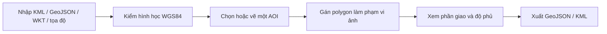

# Vùng quan tâm và phạm vi ảnh

Cập nhật: 08/10/2026. Mở **Lớp bản đồ → Nhập KML / polygon**, hoặc `/?workspace=geodata`. Công cụ độc lập với DEM và chạy tại trình duyệt, dùng được trên Vercel. Thêm `&offline=1` để không tải nền ngoài.

## Thao tác

| Tác vụ | Cách dùng |
|---|---|
| Nhập tệp | Chọn một/nhiều KML, GeoJSON hoặc WKT. Giữ tên và thuộc tính. KML MultiGeometry được tách thành đối tượng |
| Nhập văn bản | Nhiều WKT có tên như `Strix-2: POLYGON((…))`. Tọa độ `21.782919° N, 104.053554° E` tạo một điểm |
| Vai trò | Tham chiếu: nâu. AOI: xanh lá. Phạm vi ảnh: xanh dương nét đứt. Điểm/đường chỉ làm tham chiếu |
| Chọn đối tượng | Đưa vào vùng nhìn, đổi tên/vai trò, xem tọa độ và thuộc tính. Một AOI mỗi workspace, chọn mới chuyển AOI cũ thành tham chiếu |
| Vẽ AOI | Nhấp các đỉnh. Enter, Kết thúc, nhấp đúp hoặc chọn lại đỉnh đầu để khép vòng. Backspace bỏ đỉnh cuối, Esc hủy hình đang vẽ |
| Bật/tắt | Chỉ đổi hiển thị, không bỏ footprint khỏi phép tính |
| Nguồn | Định dạng, đầu vào, thời điểm nhập, thuộc tính và WKT. Thời điểm nhập không phải ngày chụp |
| Xuất | GeoJSON/KML cho cả bộ hoặc riêng AOI, copy WKT đối tượng chọn. GeoJSON kèm vai trò, nguồn và phương pháp tính |

Đối tượng nhập là dữ liệu làm việc tại trình duyệt, chưa phải lớp tác động được công bố trong tình huống ứng phó.

## Quy tắc khoa học

| Nội dung | Quy tắc |
|---|---|
| CRS đầu vào/lưu/xuất | WGS84 theo **kinh độ, vĩ độ**, tương ứng OGC:CRS84 trong GeoJSON. WKT nhận `SRID=4326`. Chưa chuyển VN2000/UTM |
| CRS hiển thị | Web Mercator EPSG:3857. Không tính diện tích theo pixel hoặc diện tích phẳng Web Mercator |
| Hình học | Kiểm khép vòng, đỉnh, tự cắt, cạnh chồng, lỗ ngoài biên/chạm biên/chồng nhau, MultiPolygon chồng diện tích |
| Độ phủ | Diện tích giao của AOI với **hợp** các footprint / diện tích AOI. Không đếm trùng vùng chồng. Chưa có footprint: chưa xác định, không ghi 0% |
| Phương pháp | Giao/hợp polygon trong kinh/vĩ độ. Diện tích xấp xỉ mặt cầu R = 6.371.008,8 m, m²/km², `polygon-coverage-v1`. Không phải diện tích ellipsoid phục vụ địa chính hoặc diện tích bề mặt địa hình |
| Z | Giữ nếu có, không tham gia phép tính độ phủ. KML thiếu Z trong hình có Z nhận mặc định 0. Chưa kiểm hệ quy chiếu đứng hoặc lấy độ cao DEM cho dữ liệu nhập |
| Footprint | Chỉ là biên hình học. Chưa xác nhận ảnh đã chụp, yêu cầu đặt chụp thành công, không mây hoặc đủ chất lượng phân tích |
| Nền ảnh | EOX Sentinel-2 cloudless 2016, giữ attribution/giấy phép. Không dùng làm bằng chứng hiện trạng |

[OGC KML](https://docs.ogc.org/is/12-007r2/12-007r2.html) quy định thứ tự tọa độ KML là kinh độ, vĩ độ, độ cao. Luồng AOI tham khảo [Copernicus Browser](https://documentation.dataspace.copernicus.eu/Applications/Browser.html). Tính hợp/giao dùng [Turf union](https://turfjs.org/docs/api/union), [intersect](https://turfjs.org/docs/7.1.0/api/intersect); diện tích dùng [Turf area](https://turfjs.org/docs/api/area).

## Giới hạn

| Phần | Giới hạn |
|---|---|
| Dung lượng | 2 MB/tệp, 10 tệp/lần, 100 đối tượng, 1.500 tọa độ/đối tượng, 15.000/workspace. Giản lược hoặc tách dữ liệu trong QGIS |
| Lỗi nhập | Một tệp trong lô bị lỗi: không thêm một phần lô, giữ nguyên bộ đang có |
| Chưa hỗ trợ | KMZ, NetworkLink, lớp ảnh KML, Track/Model, vùng vượt kinh tuyến 180°, vĩ độ ngoài ±85,05112878° |
| Lưu/chia sẻ | LocalStorage theo origin, kiểm dữ liệu khi mở lại. Xuất tệp để giữ/chia sẻ. Chưa có tài khoản, đồng bộ, checksum tệp gốc hoặc lịch sử nhập |
| Nhập lại bản xuất | Đọc hình học/tên/thuộc tính. Vai trò theo lựa chọn nhập, có thể gán lại tại Thuộc tính |

Đã kiểm ba polygon và tọa độ trong ảnh trao đổi. Hai tệp KML trong ảnh chưa được cung cấp, chưa xác nhận nội dung thực tế.

## Các bước viễn thám tiếp theo

| Ưu tiên | Chức năng | Đầu vào cần có |
|---|---|---|
| Tiếp theo | Catalog ảnh theo AOI, thời gian, sensor | STAC Item: footprint, acquisition time, collection, provider, license, asset link. Tách ảnh có sẵn khỏi yêu cầu đặt chụp |
| Tiếp theo | So các cảnh phủ AOI | Độ phủ từng cảnh/tổ hợp, thời điểm trước/sau sự kiện, độ phân giải, processing level |
| Sau catalog | Phần AOI có ảnh dùng được | Mask mây/bóng mây/nodata trên AOI. Cloud cover toàn cảnh chỉ là bộ lọc |
| Sau dữ liệu thực | SAR/chuỗi thời gian | Orbit, polarization, acquisition geometry, hiệu chỉnh bức xạ/địa hình và chất lượng. Không dùng quy tắc mây quang học cho SAR |
| Sau chọn phương pháp | Chỉ số và phát hiện thay đổi | Band, reflectance/scaling, mask, resampling, baseline, method version. Không suy ra ngập/sạt lở từ footprint |
| Khi xây platform | Job, lưu và công bố | NestJS/PostGIS, object storage, worker Python/GDAL/PROJ. Input/output có version và người duyệt |

[Copernicus STAC](https://documentation.dataspace.copernicus.eu/APIs/STAC.html) hỗ trợ tìm theo vùng và thời gian. Catalog adapter là bước tiếp của [lộ trình platform](../plans/platform.md). Backend vẫn ở mức kế hoạch.
