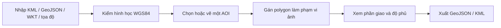
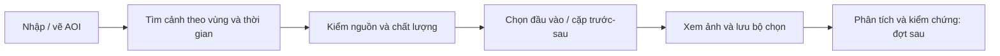

# Vùng quan tâm và phạm vi ảnh

Cập nhật: 08/10/2026. Mở **Lớp bản đồ → Nhập KML / polygon**, hoặc `/?workspace=geodata`. Công cụ độc lập với DEM và chạy tại trình duyệt, dùng được trên Vercel. Thêm `&offline=1` để không tải nền ngoài.

## Thao tác

| Tác vụ | Cách dùng |
|---|---|
| Nhập tệp | Chọn một/nhiều KML, GeoJSON hoặc WKT. Giữ tên và thuộc tính. KML MultiGeometry được tách thành đối tượng |
| Nhập văn bản | Nhiều WKT có tên như `Strix-2: POLYGON((…))`. Tọa độ `21.782919° N, 104.053554° E` tạo một điểm |
| Vai trò | Tham chiếu: nâu. AOI: xanh lá. Phạm vi ảnh: xanh dương nét đứt. Điểm/đường chỉ làm tham chiếu |
| Chọn đối tượng | Đưa vào vùng nhìn, đổi tên/vai trò, xem tọa độ và thuộc tính. Một AOI mỗi workspace, chọn mới chuyển AOI cũ thành tham chiếu |
| Vẽ AOI | Nhấp các đỉnh. Enter, Kết thúc, nhấp đúp hoặc chọn lại đỉnh đầu để khép vòng. Backspace bỏ đỉnh cuối, Esc hủy hình đang vẽ |
| Bật/tắt | Chỉ đổi hiển thị, không bỏ footprint khỏi phép tính |
| Nguồn | Định dạng, đầu vào, thời điểm nhập, thuộc tính và WKT. Thời điểm nhập không phải ngày chụp |
| Xuất | GeoJSON/KML cho cả bộ hoặc riêng AOI, copy WKT đối tượng chọn. GeoJSON kèm vai trò, nguồn và phương pháp tính |

Đối tượng nhập là dữ liệu làm việc tại trình duyệt, chưa phải lớp tác động được công bố trong tình huống ứng phó.

## Quy tắc khoa học

| Nội dung | Quy tắc |
|---|---|
| CRS đầu vào/lưu/xuất | WGS84 theo **kinh độ, vĩ độ**, tương ứng OGC:CRS84 trong GeoJSON. WKT nhận `SRID=4326`. Chưa chuyển VN2000/UTM |
| CRS hiển thị | Web Mercator EPSG:3857. Không tính diện tích theo pixel hoặc diện tích phẳng Web Mercator |
| Hình học | Kiểm khép vòng, đỉnh, tự cắt, cạnh chồng, lỗ ngoài biên/chạm biên/chồng nhau, MultiPolygon chồng diện tích |
| Độ phủ | Diện tích giao của AOI với **hợp** các footprint / diện tích AOI. Không đếm trùng vùng chồng. Chưa có footprint: chưa xác định, không ghi 0% |
| Phương pháp | Giao/hợp polygon trong kinh/vĩ độ. Diện tích xấp xỉ mặt cầu R = 6.371.008,8 m, m²/km², `polygon-coverage-v1`. Không phải diện tích ellipsoid phục vụ địa chính hoặc diện tích bề mặt địa hình |
| Z | Giữ nếu có, không tham gia phép tính độ phủ. KML thiếu Z trong hình có Z nhận mặc định 0. Chưa kiểm hệ quy chiếu đứng hoặc lấy độ cao DEM cho dữ liệu nhập |
| Footprint | Chỉ là biên hình học. Chưa xác nhận ảnh đã chụp, yêu cầu đặt chụp thành công, không mây hoặc đủ chất lượng phân tích |
| Nền ảnh | EOX Sentinel-2 cloudless 2016, giữ attribution/giấy phép. Không dùng làm bằng chứng hiện trạng |

[OGC KML](https://docs.ogc.org/is/12-007r2/12-007r2.html) quy định thứ tự tọa độ KML là kinh độ, vĩ độ, độ cao. Luồng AOI tham khảo [Copernicus Browser](https://documentation.dataspace.copernicus.eu/Applications/Browser.html). Tính hợp/giao dùng [Turf union](https://turfjs.org/docs/api/union), [intersect](https://turfjs.org/docs/7.1.0/api/intersect); diện tích dùng [Turf area](https://turfjs.org/docs/api/area).

## Giới hạn

| Phần | Giới hạn |
|---|---|
| Dung lượng | 2 MB/tệp, 10 tệp/lần, 100 đối tượng, 1.500 tọa độ/đối tượng, 15.000/workspace. Giản lược hoặc tách dữ liệu trong QGIS |
| Lỗi nhập | Một tệp trong lô bị lỗi: không thêm một phần lô, giữ nguyên bộ đang có |
| Chưa hỗ trợ | KMZ, NetworkLink, lớp ảnh KML, Track/Model, vùng vượt kinh tuyến 180°, vĩ độ ngoài ±85,05112878° |
| Lưu/chia sẻ | LocalStorage theo origin, kiểm dữ liệu khi mở lại. Xuất tệp để giữ/chia sẻ. Chưa có tài khoản, đồng bộ, checksum tệp gốc hoặc lịch sử nhập |
| Nhập lại bản xuất | Đọc hình học/tên/thuộc tính. Vai trò theo lựa chọn nhập, có thể gán lại tại Thuộc tính |

## Thiết kế bước tiếp theo: tìm và chọn ảnh

**Đề xuất, chưa tích hợp vào app.** [Maquette tương tác](assets/analysis-workspace.html) dùng hình sơ đồ và metadata giả để kiểm bố cục, không truy vấn hoặc phân tích ảnh vệ tinh. Khả năng đang chạy được mô tả ở các phần trên. Thứ tự triển khai theo [lộ trình platform](../plans/platform.md).

| Thành phần | Thiết kế |
|---|---|
| Khung làm việc | Giữ header và thanh công cụ hiện tại. Panel trái đổi rộng, ba tab **AOI / Cảnh ảnh / Lớp**. AOI đang dùng luôn hiện ở đầu panel |
| AOI | Dùng bộ nhập/vẽ hiện có. Một AOI cho mỗi lần tìm; sửa AOI đánh dấu kết quả tìm cũ và yêu cầu tìm lại, không tự thay đầu vào đã chọn |
| Tìm ảnh | Collection, khoảng thu nhận UTC, AOI. Bắt đầu với Sentinel-1 GRD và Sentinel-2 L2A. Mây chỉ áp dụng cho quang học. Kết quả có phân trang, trạng thái tải/lỗi/rỗng và thử lại |
| Dòng kết quả | Thumbnail, tên sản phẩm, thời gian UTC, độ phủ hình học AOI. Quang học: độ phân giải theo band và mây **toàn cảnh**. SAR: pass, relative orbit, polarization; phân biệt pixel spacing với spatial resolution |
| Chọn và xem | Bấm dòng/footprint để xem chi tiết. Checkbox chọn đầu vào. Bật/tắt lớp chỉ đổi hiển thị, không thay bộ chọn. Hai thao tác có state riêng |
| Chi tiết | Mở khi chọn cảnh, đóng được. Nguồn, ID, processing level, asset, CRS, chất lượng, giấy phép. Metadata thiếu ghi chưa có, không suy từ basemap |
| Trước/sau | Khay dưới map chỉ mở khi có bộ chọn. Chọn rõ vai trò trước/sau; kiểm cùng AOI, thứ tự thời gian, dữ liệu/CRS/vùng chung. Cặp SAR kiểm thêm orbit, geometry và polarization. Hai cảnh không mặc định đủ điều kiện phát hiện biến động |
| Lớp và pointer | Thứ tự từ dưới lên: nền → raster → footprint → AOI → lớp kết quả → đối tượng đang chọn. Chỉ một chế độ nhận pointer. Chi tiết/so ảnh không tự đổi vị trí panel trái |
| Màn nhỏ | Chuyển **Dữ liệu / Bản đồ**; chi tiết thay vùng dữ liệu, có nút quay lại. Không chồng ba panel nổi. Overview chỉ bật khi cần định vị vùng lớn |

Đợt đầu dùng catalog prepared qua repository, không cần backend hoặc khóa API ở trình duyệt. Chốt riêng contract AOI, scene/asset và bộ chọn; adapter sang STAC sau. Giữ provenance từ ID/nguồn/ngày thu nhận tới đầu vào kết quả. Chưa thêm tasking/đặt mua, code editor, model AI, chỉ số phổ hoặc pixel inspector khi chưa có raster phù hợp. Độ phủ footprint không thay độ phủ pixel hợp lệ hay tỷ lệ không mây trong AOI.

### Tham chiếu và lựa chọn

Đây là lựa chọn thiết kế cho DEAR từ tài liệu chính thức và ảnh người dùng cung cấp, không phải một tiêu chuẩn bắt buộc chung cho WebGIS.

| Công cụ | Áp dụng vào DEAR |
|---|---|
| [SkyFi](https://skyfi.com/en/faqs), [tasking](https://learn.skyfi.com/how-to/tasking-a-satellite-to-capture-a-new-image/) | AOI và danh sách ảnh; tách archive khỏi yêu cầu chụp. Không đưa luồng mua/assistant vào bước đầu |
| [Copernicus Browser](https://documentation.dataspace.copernicus.eu/Applications/Browser.html) | Tìm theo collection/thời gian, footprint, metadata, bộ chọn và so ảnh. Tách tìm sản phẩm khỏi hiển thị ảnh |
| [QGIS GUI](https://docs.qgis.org/3.44/en/docs/user_manual/introduction/qgis_gui.html) | Dock ổn định, thứ tự lớp, thuộc tính, identify và chế độ thao tác rõ. Không sao chép toàn bộ toolbar desktop |
| [Earth Engine](https://developers.google.com/earth-engine/guides/playground) | Inspector khi cần và Tasks cho xử lý dài. Không dùng RGB nền làm giá trị band hay thêm console sớm |
| [EOSDA LandViewer](https://eos.com/user-guide/landviewer/my_landviewer/) | Tổ hợp band, chỉ số, so ảnh và chuỗi thời gian cho đợt có raster/QA |
| [UNOSAT](https://unosat.org/products/4256) và ảnh giao diện đã gửi | Màn ứng phó tập trung tác động, phạm vi, nguồn và thời điểm; công cụ phân tích nằm ở workspace riêng. Chưa kiểm trực tiếp toàn bộ thao tác của webmap |

Proposal vẫn là đích nghiệp vụ: SAR ưu tiên sau sự kiện, phân tích tác động đường/cộng đồng rồi tạo sản phẩm cứu hộ. Catalog là đầu vào hỗ trợ luồng đó, không thay pipeline hoặc biến demo thành sản phẩm xử lý tự động.
