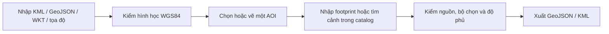
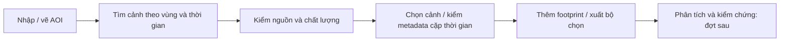

# Vùng quan tâm và phạm vi ảnh

Cập nhật: 08/10/2026. Mở **Lớp bản đồ → Dữ liệu GIS**, hoặc `/?workspace=geodata`. Công cụ độc lập với DEM và chạy tại trình duyệt, dùng được trên Vercel. Thêm `&offline=1` để không tải nền ngoài.

## Thao tác

| Tác vụ | Cách dùng |
|---|---|
| Nhập tệp | Tab Lớp: chọn một/nhiều KML, GeoJSON hoặc WKT. Giữ tên và thuộc tính; bỏ Placemark chỉ chứa ghi chú. KML MultiGeometry được tách thành đối tượng. Lỗi chỉ rõ tệp |
| Nhập văn bản | Nhiều WKT có tên như `Strix-2: POLYGON((…))`. Tọa độ `21.782919° N, 104.053554° E` tạo một điểm |
| Vai trò | Tham chiếu: nâu. AOI: xanh lá. Phạm vi ảnh: xanh dương nét đứt. Điểm/đường chỉ làm tham chiếu |
| Chọn đối tượng | Giữ vùng nhìn; nút Xem đối tượng đưa hình vào map. Đổi tên/vai trò, xem tọa độ và thuộc tính. Một AOI mỗi workspace, gán AOI mới chuyển AOI cũ thành tham chiếu |
| Vẽ AOI | Thanh công cụ: polygon hoặc hình chữ nhật qua hai góc đối diện. Polygon kết thúc bằng Enter, nút Kết thúc, nhấp đúp hoặc đỉnh đầu. Vẽ lại cập nhật AOI hiện tại. Thanh công cụ không làm map dịch chuyển |
| Chỉnh hình | Kéo đỉnh hoặc nhập kinh/vĩ độ tại tab AOI. Áp dụng mới cập nhật bản lưu; hình lỗi giữ nguyên bản cũ. Hủy/Esc bỏ bản nháp. Bắt đỉnh trong 12 pixel tới các đối tượng đang hiện |
| Hoàn tác | Ctrl/Cmd+Z, Ctrl/Cmd+Shift+Z hoặc các nút Hoàn tác/Làm lại. Trong lúc chỉnh chỉ tác động bản nháp; ngoài lúc chỉnh tác động lớp. Lịch sử 25 bước, trong phiên |
| Bật/tắt | Chỉ đổi hiển thị, không bỏ footprint khỏi phép tính |
| Nguồn | Định dạng, đầu vào, thời điểm nhập, thuộc tính và WKT. Thời điểm nhập không phải ngày chụp |
| Xuất | GeoJSON/KML cho cả bộ hoặc riêng AOI, copy WKT đối tượng chọn. GeoJSON kèm vai trò, nguồn và phương pháp tính |

Đối tượng nhập là dữ liệu làm việc tại trình duyệt, chưa phải lớp tác động được công bố trong tình huống ứng phó.

## Quy tắc khoa học

| Nội dung | Quy tắc |
|---|---|
| CRS đầu vào/lưu/xuất | WGS84 theo **kinh độ, vĩ độ**, tương ứng OGC:CRS84 trong GeoJSON. WKT nhận `SRID=4326`. Chưa chuyển VN2000/UTM |
| CRS hiển thị | Web Mercator EPSG:3857. Không tính diện tích theo pixel hoặc diện tích phẳng Web Mercator |
| Hình học | Kiểm khép vòng, đỉnh, tự cắt, cạnh chồng, lỗ ngoài biên/chạm biên/chồng nhau, MultiPolygon chồng diện tích |
| Độ phủ | Diện tích giao của AOI với **hợp** các footprint / diện tích AOI. Không đếm trùng vùng chồng. Chưa có footprint: chưa xác định, không ghi 0% |
| Phương pháp | Giao/hợp polygon trong kinh/vĩ độ. Diện tích xấp xỉ mặt cầu R = 6.371.008,8 m, m²/km², `polygon-coverage-v1`. Không phải diện tích ellipsoid phục vụ địa chính hoặc diện tích bề mặt địa hình |
| Z | Giữ nếu có, không tham gia phép tính độ phủ. KML thiếu Z trong hình có Z nhận mặc định 0. Chưa kiểm hệ quy chiếu đứng hoặc lấy độ cao DEM cho dữ liệu nhập |
| Footprint | Chỉ là biên hình học. Chưa xác nhận ảnh đã chụp, yêu cầu đặt chụp thành công, không mây hoặc đủ chất lượng phân tích |
| Nền ảnh | EOX Sentinel-2 cloudless 2016, giữ attribution/giấy phép. Không dùng làm bằng chứng hiện trạng |

[OGC KML](https://docs.ogc.org/is/12-007r2/12-007r2.html) quy định thứ tự tọa độ KML là kinh độ, vĩ độ, độ cao. Luồng AOI tham khảo [Copernicus Browser](https://documentation.dataspace.copernicus.eu/Applications/Browser.html). Tính hợp/giao dùng [Turf union](https://turfjs.org/docs/api/union), [intersect](https://turfjs.org/docs/7.1.0/api/intersect); diện tích dùng [Turf area](https://turfjs.org/docs/api/area).

## Giới hạn

| Phần | Giới hạn |
|---|---|
| Dung lượng | 2 MB/tệp, 10 tệp/lần, 100 đối tượng, 1.500 tọa độ/đối tượng, 15.000/workspace. Giản lược hoặc tách dữ liệu trong QGIS |
| Lỗi nhập | Một tệp trong lô bị lỗi: không thêm một phần lô, giữ nguyên bộ đang có |
| Chưa hỗ trợ | KMZ, NetworkLink, lớp ảnh KML, Track/Model, vùng vượt kinh tuyến 180°, vĩ độ ngoài ±85,05112878° |
| Lưu/chia sẻ | LocalStorage theo origin, kiểm dữ liệu khi mở lại. Xuất tệp để giữ/chia sẻ. Chưa có tài khoản, đồng bộ, checksum tệp gốc hoặc lịch sử nhập |
| Nhập lại bản xuất | Lựa chọn Theo tệp giữ `geometryRole` từ GeoJSON/KML của công cụ; tệp không có vai trò dùng Tham chiếu. Chọn vai trò khác để ghi đè khi nhập |

## Thiết kế bước tiếp theo: tìm và chọn ảnh

**Bước catalog prepared đã tích hợp.** Tab Cảnh ảnh dùng 12 bản ghi STAC thật: sáu Sentinel-1 GRD và sáu Sentinel-2 L2A, thu nhận 24/09–07/10/2026 quanh Chế Tạo. Snapshot metadata lấy từ Copernicus Data Space ngày 08/10/2026; `public/catalog/che-tao.json` giữ truy vấn gốc, nguồn và giấy phép. App đọc tệp cùng origin, chạy trên Vercel và trong gói offline, chưa truy vấn catalog trực tiếp. [Maquette](assets/analysis-workspace.html) là bản nghiên cứu bố cục trước triển khai.

| Thành phần | Cách dùng hiện tại |
|---|---|
| Khung làm việc | Header và thanh công cụ cố định; panel đổi rộng, ba tab **Lớp / AOI / Cảnh ảnh** có vị trí cuộn riêng. Tên AOI ở thanh công cụ |
| AOI | Một AOI cho lần tìm; sửa hình đánh dấu kết quả cũ và yêu cầu tìm lại. Bộ chọn giữ nguyên, không tự thay đầu vào |
| Tìm ảnh | Collection, ngày UTC, giao polygon AOI; mây chỉ áp dụng Sentinel-2 và là mây toàn cảnh. Thêm kết quả theo nhóm sáu. Có trạng thái tải/lỗi/rỗng và thử lại |
| Kết quả | Sensor, thời gian UTC, độ phủ hình học AOI và polarization hoặc mây. Icon thay thumbnail; chưa tải ảnh preview hoặc band |
| Chọn và xem | Bấm dòng/footprint xem metadata, checkbox đưa vào bộ chọn. Hiện/ẩn footprint và zoom không đổi bộ chọn. Nút Xem phạm vi đổi vùng nhìn khi được yêu cầu |
| Metadata | ID, nguồn STAC, processing level; SAR có pass/relative orbit/polarization/pixel spacing, quang học có GSD sản phẩm/mây. Thiếu trường ghi “—”. Pixel spacing không phải spatial resolution |
| Cặp thời gian | Hai cảnh cùng collection/mức xử lý, khác thời điểm và có vùng giao trong AOI; SAR kiểm thêm orbit/pass/mode/polarization. Chỉ kiểm metadata, chưa kiểm mask/raster/đồng đăng ký |
| Đầu ra | Bộ chọn theo thời gian lưu cục bộ; xuất JSON kèm AOI/nguồn/trạng thái kiểm và `rasterLoaded: false`. Thêm footprint vào lớp không tạo bản sao trùng ID |
| Lớp và pointer | Từ dưới lên: nền → footprint → tham chiếu → AOI → phần giao → đối tượng chọn → điểm → bản nháp. Chỉ một chế độ nhận thao tác chỉnh; chưa có raster catalog |
| Màn nhỏ | Chuyển **Dữ liệu / Bản đồ**. Inspector thay vùng map/data; Xem phạm vi đóng inspector và mở map. Không chồng ba panel nổi |

Catalog này có phạm vi/ngày hữu hạn; không có kết quả không có nghĩa là kho ảnh vệ tinh không có ảnh. Độ phủ footprint không thay độ phủ pixel hợp lệ hay tỷ lệ không mây trong AOI. GSD sản phẩm chưa mô tả độ phân giải từng band Sentinel-2. Những bước còn lại của đợt 3 gồm contract v2 đầy đủ, nguồn trực tiếp, asset raster/QA và truy nguyên đầu vào phân tích. Worker/job, chỉ số phổ và công bố theo các đợt sau của [lộ trình](../plans/platform.md); backend vẫn tạm hoãn.

### Tham chiếu và lựa chọn

Đây là lựa chọn thiết kế cho DEAR từ tài liệu chính thức và ảnh người dùng cung cấp, không phải một tiêu chuẩn bắt buộc chung cho WebGIS.

| Công cụ | Áp dụng vào DEAR |
|---|---|
| [SkyFi](https://skyfi.com/en/faqs), [tasking](https://learn.skyfi.com/how-to/tasking-a-satellite-to-capture-a-new-image/) | AOI và danh sách ảnh; tách archive khỏi yêu cầu chụp. Không đưa luồng mua/assistant vào bước đầu |
| [Copernicus Browser](https://documentation.dataspace.copernicus.eu/Applications/Browser.html) | Tìm theo collection/thời gian, footprint, metadata, bộ chọn và so ảnh. Tách tìm sản phẩm khỏi hiển thị ảnh |
| [QGIS GUI](https://docs.qgis.org/3.44/en/docs/user_manual/introduction/qgis_gui.html) | Dock ổn định, thứ tự lớp, thuộc tính, identify và chế độ thao tác rõ. Không sao chép toàn bộ toolbar desktop |
| [Earth Engine](https://developers.google.com/earth-engine/guides/playground) | Inspector khi cần và Tasks cho xử lý dài. Không dùng RGB nền làm giá trị band hay thêm console sớm |
| [EOSDA LandViewer](https://eos.com/user-guide/landviewer/my_landviewer/) | Tổ hợp band, chỉ số, so ảnh và chuỗi thời gian cho đợt có raster/QA |
| [UNOSAT](https://unosat.org/products/4256) và ảnh giao diện đã gửi | Màn ứng phó tập trung tác động, phạm vi, nguồn và thời điểm; công cụ phân tích nằm ở workspace riêng. Chưa kiểm trực tiếp toàn bộ thao tác của webmap |

Proposal vẫn là đích nghiệp vụ: SAR ưu tiên sau sự kiện, phân tích tác động đường/cộng đồng rồi tạo sản phẩm cứu hộ. Catalog là đầu vào hỗ trợ luồng đó, không thay pipeline hoặc biến demo thành sản phẩm xử lý tự động.
