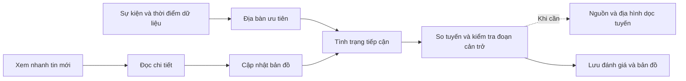

# Thiết kế giao diện

Cập nhật: 2026-10-08. Áp dụng cho web React tại `DEM_to_3D/viewer`.

## Luồng ứng phó

Luồng này phục vụ bước phân tích và bản đồ hỗ trợ quyết định trong proposal. Các giai đoạn xử lý ảnh không trở thành menu bắt buộc của người trực.

| Người trực cần trả lời | Màn hình và hành động |
|---|---|
| Cần xử lý ở đâu trước? | Sự kiện: địa bàn ưu tiên kèm lý do. Chọn địa bàn |
| Tiếp cận thế nào, vướng ở đâu? | Chi tiết địa bàn: phương án, đoạn bị chặn/chưa rõ. Mở tuyến hoặc đoạn cần kiểm tra |
| Căn cứ đã đủ chưa? | Bản ghi nguồn và mặt cắt khi cần. Tin mới phải được áp dụng trước khi lưu đánh giá mới |

Hướng dẫn dân tới nơi an toàn cần nơi trú được xác nhận và tuyến sơ tán theo phương thức. Đây là phần chưa có trong demo, không thay bằng H đề xuất. Phạm vi mở rộng ở [nền tảng GIS](../../../vsp-eo-platform/docs/architecture/geospatial-platform.md#ứng-phó-và-hướng-dẫn-tới-nơi-an-toàn).

## Màn hình và thông tin

| Vị trí | Thông tin chính | Mở khi cần |
|---|---|---|
| Sự kiện | Mốc mở đánh giá, dữ liệu đến, địa bàn ưu tiên, số đoạn bị chặn/cần xác minh | Nhật ký sự kiện, nguồn dữ liệu |
| Theo dõi xác minh | Số yêu cầu theo trạng thái, sau địa bàn ưu tiên và tình trạng đường | Danh sách tách hành động/đối tượng/căn cứ; người theo dõi và kết quả. Lưu tại trình duyệt, không gửi điều động |
| Chi tiết địa bàn | Tình trạng tiếp cận, tên/trạng thái tuyến, khoảng cách/ETA có điều kiện, việc cần kiểm tra | So tuyến, lý do ưu tiên và nguồn trong Căn cứ, dân số tham chiếu |
| Tuyến | Danh sách so sánh phương án, khoảng cách, ETA có điều kiện, tình trạng từng đoạn | Địa hình dọc tuyến, nguồn của đoạn đường |
| Đường sá | Tên, trạng thái, chiều dài. Đoạn bị chặn xếp trước | Ghi nhận, việc cần xử lý, bản ghi nguồn |
| Bản đồ | AOI, nền, mạng đường, tình trạng đường, điểm ảnh hưởng, địa bàn, điểm tập kết | Thanh tìm/lớp/đo trên trái, chú giải dưới trái, nguồn sau nút thông tin |
| Lưu đánh giá | Xem trước bản đồ 2D và nhận định theo tuyến đang chọn | PNG; PDF, GeoJSON và JSON trong Định dạng khác |
| Chuông thông báo | Hộp xem nhanh tin mới | Chi tiết tin, cập nhật bản đồ, lịch sử thông báo |
| Cài đặt | Ngôn ngữ, sáng/tối, font | Quản lý mô hình địa hình, đặt lại phiên |
| Thời điểm dữ liệu trên header | Mốc bản đồ đang xem | Nhật ký sự kiện và chọn bản dữ liệu trước/sau tin đã áp dụng |
| Lớp bản đồ | Nền và nhóm lớp nghiệp vụ | Độ rõ, lọc đường, nhãn địa danh, so ảnh trước/sau |

Panel bên trái chỉnh độ rộng hoặc thu gọn bằng nút đầu toolbar. Giữ tab, đối tượng và tuyến khi thu gọn. Chọn đối tượng sẽ mở lại panel. Ba tab **Sự kiện / Đường sá / Địa bàn** nằm trên panel, cùng hàng với thanh công cụ bản đồ. Mobile chuyển giữa **Thông tin** và **Bản đồ**.

Toolbar cố định: tìm kiếm và **Lớp / Đo / Vị trí** bên trái, điều hướng và **2D / 3D** bên phải. Khi vùng bản đồ hẹp còn 600 px, hai nhóm chuyển thành hai hàng. Canvas và cửa sổ công cụ ở bên dưới. Nút panel trung tính ở đầu toolbar, giữ vị trí khi thu/mở panel. Thông báo và cài đặt nằm trên toolbar khi mở.

## Hành vi

| Thao tác | Kết quả |
|---|---|
| Đo trên bản đồ | Chuyển sang 2D, đóng lớp/mặt cắt và ẩn chú giải. Có 6 kiểu đo, bắt điểm, chỉnh đỉnh, đổi đơn vị và giữ kết quả. Không đổi tuyến hoặc căn cứ. Quy tắc tại [hiển thị bản đồ](cartography.md#đo-trên-bản-đồ) |
| Thông tin vị trí | **Vị trí** trên toolbar mở công cụ trên 2D/3D. Chọn điểm, đọc tọa độ và độ cao. Có đổi hệ tọa độ và sao chép |
| Sắp xếp công cụ | Kéo tiêu đề bảng lớp/đo/tọa độ trên desktop. Thu gọn chú giải, tắt lớp hoặc đổi chế độ nhãn trong Lớp bản đồ. Không di chuyển tọa độ đối tượng nghiệp vụ |
| Chọn địa bàn mới | Mở chi tiết và tuyến mặc định của địa bàn |
| Đổi tuyến | Đổi tuyến trên bản đồ và thông tin tuyến đang xem. Tình trạng tiếp cận chung của địa bàn vẫn dựa trên tất cả tuyến đã biết |
| Chọn số đoạn bị chặn/chưa rõ | Xóa từ khóa tìm kiếm, mở nhóm đường tương ứng, kể cả khi đang xem điểm ảnh hưởng |
| Tìm trên bản đồ | Tìm tên/mã hoặc tiếng Việt không dấu. Enter chọn khi danh sách mở. Escape đóng, phím lên/xuống mở lại. Chọn kết quả bật lớp tương ứng và đưa đối tượng vào vùng nhìn |
| Bấm lại địa bàn đang xem | Giữ tab và tuyến đã chọn |
| Chọn đoạn thuộc tuyến đang xem | Giữ địa bàn và tuyến; mở ghi nhận/nguồn/mặt cắt ngay dưới đoạn, đồng thời đánh dấu trên bản đồ. Đổi tuyến bỏ lựa chọn đoạn |
| Chọn đường ngoài tuyến hoặc điểm ảnh hưởng | Mở chi tiết đối tượng. Từ đường có thể mở đúng tuyến sử dụng đoạn đó; đóng chi tiết trở lại ngữ cảnh và vị trí cuộn trước |
| Xem mặt cắt một đoạn đường | Chọn đường → Mặt cắt địa hình. Lấy mẫu chính hình đoạn đường, không cần chọn địa bàn/tuyến trước |
| Đóng chi tiết | Trở về nơi mở chi tiết, giữ tìm kiếm, bộ lọc và vị trí cuộn |
| Đọc tin hoặc xem đoạn đường từ tin | Không đổi dữ liệu bản đồ |
| Cập nhật bản đồ | Áp dụng tin và cập nhật đánh giá tiếp cận |
| Mở Lớp bản đồ | Đóng mặt cắt, tạm ẩn chú giải. Click ngoài hoặc Escape đóng lớp |
| Điều chỉnh hiển thị | Không thay kết quả đánh giá. Lọc đường vẫn giữ đoạn bị ảnh hưởng và tuyến đang chọn. Độ rõ không làm mờ cảnh báo |
| Xem lại thời điểm | Đường, căn cứ, tuyến và ưu tiên cùng một bản dữ liệu. Không hủy tin đã áp dụng. Có nút về dữ liệu mới nhất |
| Theo dõi xác minh | Chưa xử lý / Đang xử lý / Chờ hỗ trợ / Hoàn tất. Hiện nội dung cần xác nhận theo loại yêu cầu. Có người phụ trách khi xử lý; chờ hỗ trợ và hoàn tất cần ghi lý do/kết quả. Căn cứ đổi mở lại việc, giữ ghi nhận trước trong nhật ký |
| Nhật ký | Chung một màn cho báo cáo, phân tích, công việc và cập nhật bản đồ. Phân biệt giờ quan sát, nhận tin và thao tác tại trình duyệt; có lọc và xuất JSON. Không coi mốc phân tích là cảnh báo được ban hành |
| Xác minh tuyến | Hiện phương thức dự kiến, tình trạng xác minh toàn tuyến và giờ ghi nhận mới nhất trên tuyến. Ghi nhận tại một điểm không xác nhận đã kiểm tra toàn tuyến |
| So ảnh | Chọn hai GeoTIFF có ngày, nguồn và vùng chung. Pan/zoom cùng bản đồ, kéo thanh để so. Vùng thiếu ảnh để trống. Không tự xác nhận sạt lở |
| Đặt lại phiên | Về dữ liệu ban đầu, bỏ lựa chọn/bộ lọc/hình đo, cặp ảnh tạm và lịch sử công việc cục bộ. Giữ font, theme và chiều rộng panel |
| Đổi tuyến khi mở mặt cắt | Lấy mẫu tuyến mới, đặt vị trí đọc về đầu tuyến |
| Nhiều điểm quá gần nhau | Số đếm cho nhóm cùng loại trên 2D. Nhóm khác loại hoặc 3D có danh sách chọn. Giữ tên địa bàn ưu tiên và đối tượng đang xem khi có chỗ. Xem khu vực để tách các điểm |
| GLB hoặc GPU lỗi | Chuyển về 2D, giữ lựa chọn. 2D không tải mô hình GLB |
| Lưu đánh giá | Chụp snapshot khi mở xem trước. Mọi định dạng dùng cùng snapshot. Đóng và mở lại sau khi đổi tuyến hoặc cập nhật tin để lấy đánh giá mới |

Thời điểm `triggeredAt` là **Mở đánh giá**, chưa phải giờ ban hành cảnh báo. Theo dõi xác minh dùng nguồn hiện có và thao tác nhập của người trực; lịch sử tối đa 500 bản ghi theo dataset, không đồng bộ hoặc xác thực người nhập. Khi xem bản cũ, yêu cầu chỉ đọc. Hoàn tất không xác nhận thông đường hoặc an toàn. Quản lý ứng phó thực cần mục tiêu, đơn vị/nguồn lực, thời gian thực hiện, thẩm quyền phê duyệt và cập nhật hiện trường; chưa triển khai điều động hoặc phát cảnh báo. Tham khảo [ArcGIS Operations Management](https://doc.arcgis.com/en/arcgis-solutions/latest/reference/use-operations-management.htm) và [FEMA ICS](https://training.fema.gov/emiweb/is/icsresource/icsforms/), cần đối chiếu quy trình của đơn vị vận hành. Dữ liệu mô phỏng được ghi trong **Nguồn dữ liệu** và nhật ký.

Quy tắc tính ưu tiên và tuyến: [phân tích ứng phó](../architecture/response-analysis.md). Thành phần: [design system](design-system.md). Ký hiệu và mặt cắt: [hiển thị bản đồ](cartography.md). Luồng trình diễn: [walkthrough](../operations/walkthrough.md).
