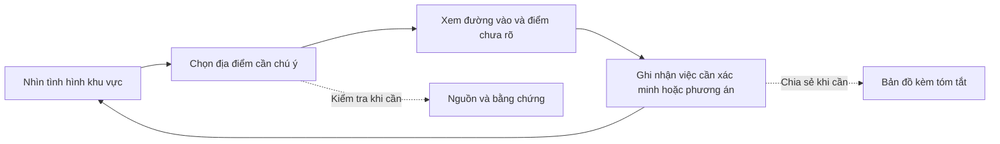

# Đánh giá luồng ứng phó DEAR

> Lưu trữ, 2026-09-29. Tài liệu ghi nhận vấn đề của prototype cũ; không dùng làm đặc tả cho web hiện tại. Xem [yêu cầu sản phẩm](../product/requirements.md), [thiết kế giao diện](../product/interface.md) và [design system](../product/design-system.md).

**Cập nhật 2026-09-30:** đã áp dụng hướng một workspace vào [bản mẫu DEAR](../../../references/SIC2026/DEAR/index.html). Các quan sát lỗi ở mục 2 mô tả bản cũ ngày 29/09. Quy tắc giao diện mới nằm trong [README của bản mẫu](../../../references/SIC2026/DEAR/design-system/README.md); chưa thay đổi app terrain hoặc phạm vi bàn giao SIC. `references/` được ignore cục bộ nên các liên kết này chỉ có trên máy giữ tài liệu.

**Đề xuất:** một không gian bản đồ để nắm tình hình, chọn nơi cần chú ý, xem khả năng tiếp cận và cập nhật thông tin. Bằng chứng mở theo địa điểm/đoạn đường; xuất bản tin là thao tác chia sẻ. Không cần bốn menu ngang hàng.

Đã đọc đủ 5 trang proposal, xem bốn màn HTML bằng Chrome và thử các thao tác liên quan. Đây là đánh giá thiết kế và khả năng sử dụng qua kiểm tra trực tiếp, chưa phải kết quả thử nghiệm với cán bộ ứng phó. Tài liệu này chưa thay thế yêu cầu, kế hoạch hay tiêu chí nghiệm thu hiện có.

## 1. Mục tiêu và người dùng

[Proposal](../../../references/SIC2026/VinSpace_SIC2026_proposal.pdf), trang 1–4, tập trung vào khoảng trống thông tin sau thiên tai: cộng đồng nào có thể bị cô lập, đường nào còn tiếp cận được, nơi nào cần ưu tiên nguồn lực. Bản đồ ưu tiên là sản phẩm chính; PDF/GeoPackage là cách đưa thông tin tới người sử dụng. Proposal không quy định phải có bốn màn hình.

Mục tiêu **3–6 giờ** là tạo sản phẩm phân tích nhanh; proposal chưa định nghĩa đầy đủ điểm bắt đầu phép đo và có nêu giới hạn chờ ảnh. Không được biến mục tiêu này thành cam kết có tuyến cứu hộ khả dụng trong 3–6 giờ kể từ khi thiên tai xảy ra. Cần ghi riêng giờ sự kiện, giờ chụp, giờ nhận dữ liệu, giờ phân tích và giờ xác minh thực địa. Trong thời gian chờ ảnh, vẫn hiển thị dữ liệu nền và tin hiện trường đang có.

Các vai trò sau là giả định thiết kế theo yêu cầu người dùng, cần kiểm chứng bằng trao đổi nghiệp vụ; không phải mô tả thẩm quyền pháp lý.

| Người dùng | Việc cần giải quyết | App cần giúp |
|---|---|---|
| Cán bộ trực ban/đầu mối điều phối ứng phó | Nắm nhiều địa điểm, chọn nơi cần xác minh hoặc hỗ trợ trước | Bản đồ chung, lý do ưu tiên, điểm chặn, mức độ cập nhật và đầu mối phụ trách nếu có |
| Trưởng thôn/cán bộ xã | Biết tình hình địa bàn, báo lại điều quan sát được | Tìm bằng tên quen thuộc, xem chi tiết ngắn, gửi/cập nhật tin có vị trí và thời điểm; dùng được trên điện thoại |
| Đầu mối khí tượng/viễn thám | Cung cấp và kiểm tra thông tin mưa, ảnh, tác động | Nguồn, thời điểm, vùng chưa quan sát được, nhận định cần kiểm chứng; không mặc định có nút điều động |
| Đơn vị hỗ trợ/nhân đạo | Biết nơi cần hỗ trợ, khả năng tiếp cận và bên đang xử lý | Nhu cầu đã biết, tình trạng hỗ trợ có nguồn, điểm liên hệ và bản đồ chia sẻ |

**Persona chính cho SIC:** cán bộ trực ban tại đầu mối điều phối địa phương, dùng laptop. Không cần bốn ứng dụng theo vai trò. Pilot có thể thêm quyền và giao diện phù hợp từng nhóm; điện thoại là yêu cầu quan trọng nếu đưa trưởng thôn/cán bộ hiện trường vào nhóm sử dụng thực tế.

## 2. Đánh giá bản thiết kế hiện tại

| Nội dung | Nhận xét | Điều chỉnh |
|---|---|---|
| Bản đồ + danh sách cộng đồng | Đúng hướng; chọn địa điểm làm rõ đường và lý do ưu tiên | Giữ làm nền tảng luồng chính |
| Bốn menu Quyết định/Bằng chứng/Tuyến đường/Bản tin | Buộc người dùng tự ghép các phần của cùng một vụ việc | Một bản đồ; mở chi tiết theo đối tượng, giữ ngữ cảnh |
| Điểm cô lập 0,92 và hạng 1/7 | Chưa giải thích đủ để trở thành thứ tự điều phối nguồn lực | Hiện lý do và mức ưu tiên do nghiệp vụ duyệt; điểm mô hình nằm trong chi tiết |
| “Bị cô lập” nhưng đồng thời đề xuất PR-7 còn đoạn chưa rõ | Trộn đường chính bị chặn với kết luận không còn cách tiếp cận | Nêu “đường chính bị chặn; tuyến khác cần xác minh”, kèm phương tiện và thời điểm |
| “Điều động”, “Gửi tuyến cho SAR-2” | Ngụ ý đã có nguồn lực, người nhận và quy trình giao nhận | SIC dùng “Xem phương án”, “Ghi chú cần xác minh”, “Chia sẻ”; không báo đã gửi nếu chưa có tích hợp |
| Trực thăng, drone, lịch ảnh kế tiếp, tải trọng và ngưỡng bay | Các chi tiết giả lập tạo cảm giác hệ thống đã vận hành đầy đủ | Rút khỏi luồng SIC chính. Bãi đáp ứng viên, nếu trình diễn, phải ghi rõ chưa đánh giá vận hành |
| Chuỗi xử lý ảnh trong tab Diễn biến | Có ích cho người phân tích, ít giúp người trực ban biết chuyện mới xảy ra | Mặc định hiện thay đổi ảnh hưởng địa điểm/tuyến; tiến trình xử lý nằm trong chi tiết dữ liệu |
| Báo cáo và nguồn | Có giá trị khi kiểm tra hoặc bàn giao | Không bắt buộc đi qua trước khi xem tình hình và phương án |

**Kết quả kiểm tra prototype, không phải lỗi đã xác nhận của app terrain:**

| Thao tác | Quan sát trực tiếp |
|---|---|
| Chọn Khau Mang → mở Tuyến đường | Màn tuyến quay về Nậm Khắt |
| Chọn bằng chứng U-1 | Kết luận bên phải vẫn là LS-02 chặn NR-18 |
| Nhập chuỗi không tồn tại vào ô tìm kiếm | Danh sách vẫn giữ cả 7 cộng đồng |
| Mở ở 1366×768 | Khung 1440×900 bị thu xuống 85,3%; chữ 13 px còn khoảng 11,1 px |
| Mở ở 390×844 | Cả màn bị thu xuống 27,1%, không chuyển bố cục; không dùng được để đọc và thao tác |

Các ảnh kiểm tra lưu trong `references/SIC2026/DEAR-review-captures/` trên máy rà soát. Dữ liệu artifact là giả lập theo `DOC-TRUOC.txt`; màn làm việc cần có nhãn giả lập hiển thị thường trực.

## 3. Use case và luồng đề xuất

Luồng không bắt buộc đi qua tất cả các bước. Người đã biết địa điểm có thể tìm và mở trực tiếp.

| Use case | Câu hỏi của người dùng | Thông tin/thao tác chính | Phạm vi SIC đề xuất |
|---|---|---|---|
| UC01 — Nắm tình hình | Khu vực nào có vấn đề? Có gì chưa biết? | Cộng đồng, tác động, đường bị chặn/nghi chặn, vùng thiếu quan sát; thời điểm dữ liệu | Bắt buộc; dữ liệu chuẩn bị trước |
| UC02 — Chọn nơi cần chú ý | Nơi nào cần hỗ trợ hoặc xác minh trước, vì sao? | Lý do ngắn: mất liên lạc, đường chính bị chặn, nhu cầu được báo; tách dân số nền và người bị ảnh hưởng | Bắt buộc; nhóm ưu tiên được BA/PO duyệt, không cần tự chấm điểm |
| UC03 — Xem khả năng tiếp cận | Từ điểm tập kết này, phương án nào còn đáng xem xét? | Đầu/cuối, phương tiện, đoạn chặn/chưa rõ, nguồn/giờ; so hai tuyến trong cùng bản đồ | Bắt buộc; hai tuyến chuẩn bị trước, không tự sinh tuyến |
| UC04 — Ghi nhận và cập nhật | Tin mới thay đổi điều gì? Còn cần xác minh ở đâu? | Gắn tin với địa điểm/đoạn đường; giờ quan sát, nguồn, mức xác minh và nội dung trước/sau | Demo ít nhất một cập nhật có kịch bản; nếu lưu ghi chú cục bộ phải ghi rõ chưa đồng bộ |
| UC05 — Kiểm tra căn cứ | Vì sao app nói như vậy? | Mở nguồn/ảnh/báo cáo của đúng nhận định; đóng lại vẫn ở vị trí cũ | Bắt buộc cho nhận định được demo, không là bước bắt buộc của mọi lượt dùng |
| UC06 — Chia sẻ tình hình | Gửi đồng nghiệp thông tin đang xem bằng cách nào? | Bản đồ + vài dòng tóm tắt + giờ/phiên bản + điểm chưa xác minh | PNG và sao chép tóm tắt; PDF/GeoPackage theo kế hoạch sau SIC |

**Quy tắc thông tin quyết định trải nghiệm:**

- Tách **nhu cầu hỗ trợ**, **khả năng tiếp cận** và **mức xác minh**. Một điểm thiếu dữ liệu không tự rơi xuống mức ưu tiên thấp.
- Dân số toàn bản không đồng nghĩa số người bị ảnh hưởng, bị thương hoặc cần sơ tán. Số chưa biết hiển thị “Chưa có thông tin”, không thay bằng 0. OCHA cũng tách dữ liệu dân số nền và số người bị ảnh hưởng trong [COD-PS/COD-HP](https://knowledge.base.unocha.org/wiki/spaces/imtoolbox/pages/143458328/Glossary).
- “Thông” phải gắn với phương tiện, đoạn đường, nguồn và thời điểm; không suy ra từ việc chưa phát hiện sạt lở. Không dùng riêng điểm tin cậy AI để xác nhận đường đi được.
- Bằng chứng đầy đủ có thể mở sau; **nguồn ngắn, giờ quan sát và trạng thái xác minh** phải thấy ngay cạnh nhận định chính.
- Tin mới hoặc tin mâu thuẫn được đánh dấu để người dùng xem lại. Không tự ghi đè báo cáo cũ, tự đổi tuyến đang chọn hoặc tự điều động.
- Nếu chưa đủ dữ liệu, kết quả hợp lệ là “chưa xác định được tuyến khả dụng” cùng điểm cần kiểm tra; không bắt buộc lúc nào cũng có một tuyến đề xuất.

## 4. Bố cục và design system

*Phác thảo đề xuất; vị trí, đường và thông tin đều giả lập. Hình mô tả trạng thái sau khi chọn một địa điểm.*

| Thành phần | Cách dùng |
|---|---|
| Thanh trên | Sự kiện/khu vực, tìm địa điểm, giờ dữ liệu, trạng thái kết nối và Chia sẻ |
| Bảng trái | Ban đầu là danh sách cần chú ý. Chọn một địa điểm thì thay bằng chi tiết; nút quay lại giữ bộ lọc và vị trí cuộn |
| Bản đồ chính | Giữ phần lớn chiều rộng, mặc định 2D; nhãn địa danh, đường, tác động và vùng thiếu dữ liệu. Tự căn vùng nhìn tránh phần bị panel che |
| Chi tiết tuyến | Mở từ địa điểm/đường đang chọn; so hai phương án tại chỗ. Biểu đồ độ cao chỉ mở khi cần |
| Nguồn/bằng chứng | Ngăn chi tiết tạm thời hoặc lớp phủ trong cùng workspace; giữ địa điểm, tuyến, vùng nhìn khi đóng |
| Cập nhật | Danh sách thay đổi có liên quan; phân biệt giờ tin đến và giờ sự việc được quan sát |
| Điện thoại, khi triển khai pilot | Bản đồ và bảng chi tiết kéo lên từ dưới; chuyển danh sách/bản đồ, không thu nhỏ toàn màn desktop |

| Hạng mục | Quyết định đề xuất |
|---|---|
| Font và token | Giữ Inter, font cục bộ, token màu/khoảng cách. Mono chỉ dùng cho mã và số cần so sánh |
| Chữ và nút | Nội dung chính 14–16 px, nguồn/giờ 12–13 px; nút quan trọng hướng tới vùng bấm 44×44 px. Đây là mục tiêu thiết kế, không phải cách diễn đạt yêu cầu AA |
| Chủ đề | Sáng làm phương án mặc định để thử với laptop/máy chiếu; tối là lựa chọn. Kiểm chứng ngoài trời và trong phòng trước khi chốt |
| Panel | Nền đặc hoặc gần đặc; giảm kính mờ và bóng. Không để đọc dữ kiện quan trọng phụ thuộc ảnh vệ tinh phía sau |
| Màu và ký hiệu | Đỏ: chặn/ảnh hưởng nghiêm trọng; hổ phách: cần kiểm tra; xám có nét riêng: chưa có dữ liệu; xanh dương: đối tượng/tuyến đang chọn; xanh lá: trạng thái tiếp cận có căn cứ. Nhãn và kiểu nét luôn đi cùng màu |
| Nền bản đồ | Nền địa hình/địa danh dễ đọc làm mặc định đề xuất; ảnh vệ tinh bật khi cần. 3D là công cụ xem địa hình, không là điều kiện để hoàn thành luồng |
| Nội dung | Dùng “điểm tập kết”, “thôn/bản”, “đoạn cần xác minh”; mã LS-02/HLZ/FOB và điểm mô hình nằm sau tên dễ hiểu |
| Trạng thái | Thiết kế đủ thiếu ảnh, dữ liệu cũ, mất mạng, hai nguồn mâu thuẫn, không có tuyến khả dụng, gửi thất bại và thay đổi chưa đồng bộ |

Kiểm tra tương phản trên **nền thực tế**, không chỉ màu token: chữ thường tối thiểu 4,5:1 theo [WCAG 1.4.3](https://www.w3.org/WAI/WCAG22/Understanding/contrast-minimum.html). [WCAG 2.5.8](https://www.w3.org/WAI/WCAG22/Understanding/target-size-minimum.html) quy định mục tiêu AA 24×24 CSS px hoặc đáp ứng ngoại lệ/khoảng cách; không đồng nhất với mục tiêu 44 px ở trên. Cần kiểm tra bàn phím, focus, phóng chữ và phương án đọc dữ liệu ngoài bản đồ.

## 5. Ưu tiên cho bản SIC

| Mức | Nội dung |
|---|---|
| Làm trước | Một workspace; giữ địa điểm/tuyến khi mở chi tiết; trạng thái đường và nguồn/giờ nhất quán; đọc được ở 1366×768 |
| Luồng demo chính | Mở khu vực → chọn cộng đồng → thấy đường chính bị chặn và tuyến khác còn điểm chưa rõ → mở đúng căn cứ → nhận một cập nhật có kịch bản → xem lại phương án |
| Hỗ trợ bàn giao | Chia sẻ PNG/tóm tắt từ trạng thái hiện tại; 2D khi 3D lỗi. Chức năng xuất vẫn được giữ, không chiếm một menu chính |
| Sau SIC | Đồng bộ báo cáo thực địa, phân quyền, xác nhận giao nhận, quản lý nguồn lực, định tuyến tự động, tích hợp gửi tin và đánh giá bãi đáp |

UC04 là phần bổ sung so với phạm vi cũ: đề xuất giới hạn ở cập nhật có kịch bản cho demo, không kéo theo backend vận hành. Nếu chốt hướng này, cập nhật lần lượt [yêu cầu](../product/requirements.md), [giao diện](../product/interface.md), [nghiệm thu](acceptance.md) và [task SIC](../tasks/sic-2026.md); giữ các mã P/D/A đang có để truy vết. Mốc bàn giao hiện tại không tự thay đổi theo tài liệu đánh giá.

Trước khi chốt giao diện, thử với người đại diện trực ban và cán bộ xã: tìm nơi cần chú ý, giải thích lý do, chỉ ra đoạn chưa xác minh, xem một cập nhật và chia sẻ đúng địa điểm. Ghi thời gian, số lần cần trợ giúp và lỗi diễn giải. Mục tiêu đề xuất cho lượt mở đầu là nắm được địa điểm và vấn đề chính trong khoảng một phút; chưa có số đo thực tế.

**Kết luận:** giữ phần bản đồ, ngôn ngữ Việt/Anh và nền tảng token của artifact; thiết kế lại cách tổ chức thông tin quanh địa điểm và công việc ứng phó. Không lấy bốn màn hình hiện tại làm cấu trúc bắt buộc của sản phẩm.
